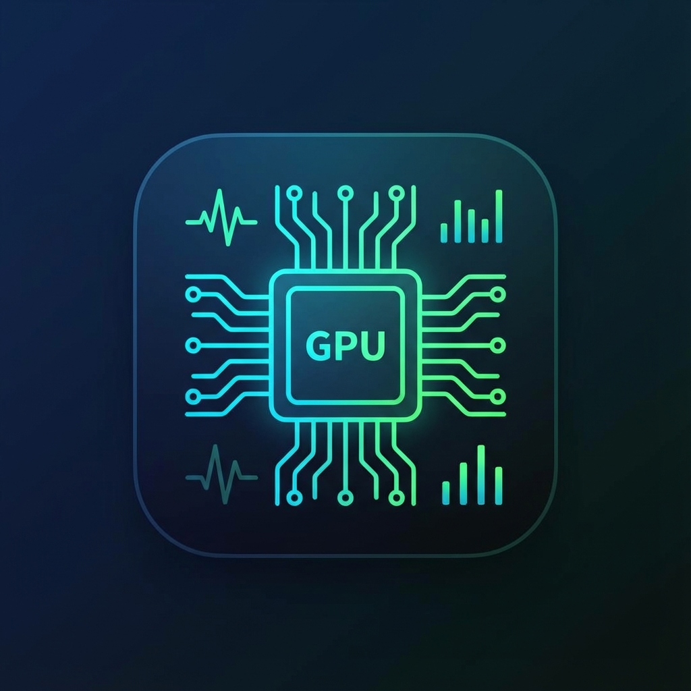

# ML Workstation Health Dashboard

Real-time monitoring dashboard for ML/DL workstation performance with GPU metrics, bottleneck detection, and anomaly alerts.



## Features

- 🎯 **Real-time GPU Monitoring** - NVML-based RTX 3090/4090 tracking
- 📊 **Multi-GPU Support** - Ready for multi-GPU setups
- 🔍 **Bottleneck Detection** - Intelligent detection of data preprocessing, I/O, thermal, and power bottlenecks
- 📈 **Live Charts** - 60-second history with Chart.js
- 🚨 **Smart Alerts** - Only alerts for real issues (no false positives)
- 💾 **Persistent Storage** - SQLite metrics database
- 🎨 **Clean UI** - Dark theme, WebSocket real-time updates

## Quick Start

### Option 1: Desktop Launcher (Recommended)

1. **Install**: Already installed! Search for "ML Dashboard" in Ubuntu app menu
2. **Pin**: Right-click → Add to Favorites
3. **Launch**: Click icon or use quick actions (Start/Stop/Restart)

### Option 2: Command Line

```bash
cd /home/omar/ai-projects/workstation-dashboard

# Start dashboard
./dashboard.sh start

# Open in browser
./dashboard.sh open

# Other commands
./dashboard.sh status    # Check status
./dashboard.sh logs      # View logs
./dashboard.sh restart   # Restart
./dashboard.sh stop      # Stop
```

## Access

- **Dashboard**: http://localhost:8000
- **API**: http://localhost:8000/api/metrics
- **Status**: `./dashboard.sh status`

## System Requirements

- Ubuntu 22.04+ (or similar Linux with systemd)
- Python 3.8+
- NVIDIA GPU with CUDA support
- NVML/pynvml library

## Architecture

- **Backend**: FastAPI + asyncio
- **Frontend**: Vanilla JS + Chart.js
- **Database**: SQLite
- **GPU**: NVML (pynvml)
- **Service**: systemd user service

## Key Metrics

### GPU

- Utilization, memory, temperature, power
- Clock speeds (GPU + memory)
- PCIe bandwidth and generation
- Process-level VRAM usage
- Throttling status

### CPU

- Per-core utilization
- Frequency, temperature
- Load averages
- CPU features (AVX2, AVX512)

### Memory

- RAM usage and availability
- Swap monitoring
- Active/inactive memory
- NUMA topology

### Storage

- Disk usage per partition
- I/O rates (read/write)
- HuggingFace cache size

### ML

- CUDA version
- Active ML processes
- Framework detection (PyTorch, TensorFlow)

## AI agent access

- `mcp_server/` - MCP server exposing the dashboard (metrics, history export,
  RGB lighting control) to Claude and other MCP-compatible agents as 8 tools.
  See `mcp_server/README.md` for setup.
- `skill/dashboard-monitor/` - Claude skill documenting how to use those
  tools (or the REST API directly as a fallback) for common workflows:
  checking machine health, investigating a past issue, exporting history,
  controlling lighting.

## Documentation

- `CHANGELOG.md` - Version history and changes
- `MAINTENANCE.md` - Complete maintenance and troubleshooting guide
- `SERVICE_SETUP.md` - Service installation guide
- `DASHBOARD_REVIEW_COMPLETE.md` - Full bug/enhancement review (85 issues)

## Recent Fixes (v1.1.0)

- ✅ Fixed false swap memory alerts (BUG-C01)
- ✅ Fixed false bottleneck alerts (BUG-C12)
- ✅ Enhanced VRAM process display (BUG-C02)
- ✅ Fixed dashboard hanging (sudo dmidecode blocking)
- ✅ Added systemd service with auto-start
- ✅ Created custom GPU-themed icon

## Development

```bash
# Activate virtual environment
source venv/bin/activate
```

The Fan Profile panel talks to CoolerControl and needs its login password:

```bash
export COOLERCONTROL_PASSWORD=<your CoolerControl CCAdmin password>
```

Without it, the panel just shows "CoolerControl not available" — everything else in the dashboard works normally.

```bash
# Run in development mode
python app.py

# Run tests
python -m pytest tests/

# Check logs
journalctl --user -u ml-dashboard -f
```

## Troubleshooting

**Dashboard not loading?**

```bash
./dashboard.sh status
./dashboard.sh restart
```

**No GPU data?**

- Verify NVIDIA drivers: `nvidia-smi`
- Check NVML initialization in logs

**False alerts?**

- Review `config.py` thresholds
- Check `MAINTENANCE.md` for known behaviors

## Contributing

See `MAINTENANCE.md` for guidelines on:

- Adding new metrics
- Modifying alert logic
- Testing procedures
- Performance benchmarks

## License

Private project - All rights reserved

## Version

**Current**: 1.1.0  
**Last Updated**: 2025-12-21

## Support

For issues, refer to:

1. `MAINTENANCE.md` - Troubleshooting guide
2. `./dashboard.sh logs` - Service logs
3. Browser console - WebSocket errors
